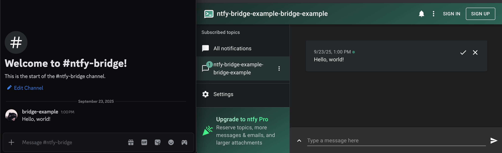

# ntfy-bridge

A Discord to NTFY message bridge that forwards messages from a specific Discord channel to NTFY. This bridge allows you to receive Discord channel messages as notifications through NTFY, enabling seamless integration with your notification workflow.

## Features

- Per-User Topics.
  - Messages are posted to a topic with the same name as the user who posted to discord. Check the image below for an example.
- Real-time message forwarding from Discord to NTFY
- Support for authentication with NTFY servers
- Easy setup with environment variables
- Docker support for containerized deployment

## Installation

### Using Docker

```bash
docker compose up -d
```

### Manual Installation

```bash
# Install dependencies
npm install

# Start the service
npm start
```

## Environment Variables

The following environment variables are required:

- `DISCORD_BOT_TOKEN`: Your Discord bot token
- `DISCORD_CHANNEL_ID`: The ID of the Discord channel to monitor
- `NTFY_URL`: The base URL of your NTFY server
- `NTFY_AUTH_TOKEN`: Authentication token for NTFY (optional)
- `NTFY_PREFIX`: A hardcoded prefix before the discord username (optional)

## Example

Here's how the notifications appear in NTFY:



## Usage

1. Set up your environment variables in a `.env` file or your environment
2. Start the service using Docker or manual installation
3. The bridge will automatically forward messages from the specified Discord channel to your NTFY instance

## Contributing

Contributions are welcome! Please feel free to submit a Pull Request.

## License

This project is open source and available under the MIT License.
