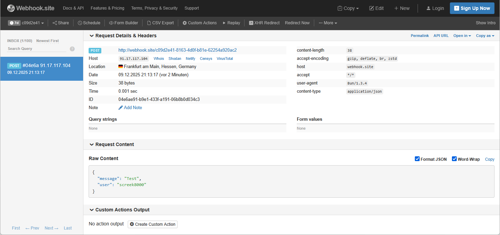

# discord-to-ha-bridge

A Discord to HA (Home Assistant) message bridge that forwards messages from a specific Discord channel to a HA webhook.

This project is based on https://github.com/alexgaudon/ntfy-bridge. Thanks!

## Features

- Messages from Discord are posted to a HA webhook
- The POST request contains a json body with the message and the user which sent the message. Check the image below for an example.
- Real-time message forwarding from Discord to HA
- Easy setup with environment variables
- Docker support for containerized deployment

## Installation

### Using Docker

Create .env file with environment variables (see below).

```bash
docker compose up -d
```

### Manual Installation

```bash
# Install dependencies
npm install

# Start the service
npm start
```

## Environment Variables

The following environment variables are required:

- `DISCORD_BOT_TOKEN`: Your Discord bot token
- `DISCORD_CHANNEL_ID`: The ID of the Discord channel to monitor
- `HA_WEBHOOK_URL`: The webhook URL of your HA server (or other kind of server that supports json POST requests). E.g. http://home-assistant:8123/api/webhook/-ZCo5AqOJ1ybvLA5o_50M4N0m

## Example

Here's how the notification appears on https://webhook.site:



## Usage

1. Set up your environment variables in a `.env` file or your environment
2. Start the service using Docker or manual installation
3. The bridge will automatically forward messages from the specified Discord channel to your HA webhook
4. Inside the HA automation the message and user can be accessed as follows:
    * message: `{{ trigger.json.message }}`
    * user: `{{ trigger.json.user }}`

## Contributing

Contributions are welcome! Please feel free to submit a Pull Request.

## License

This project is open source and available under the MIT License.
